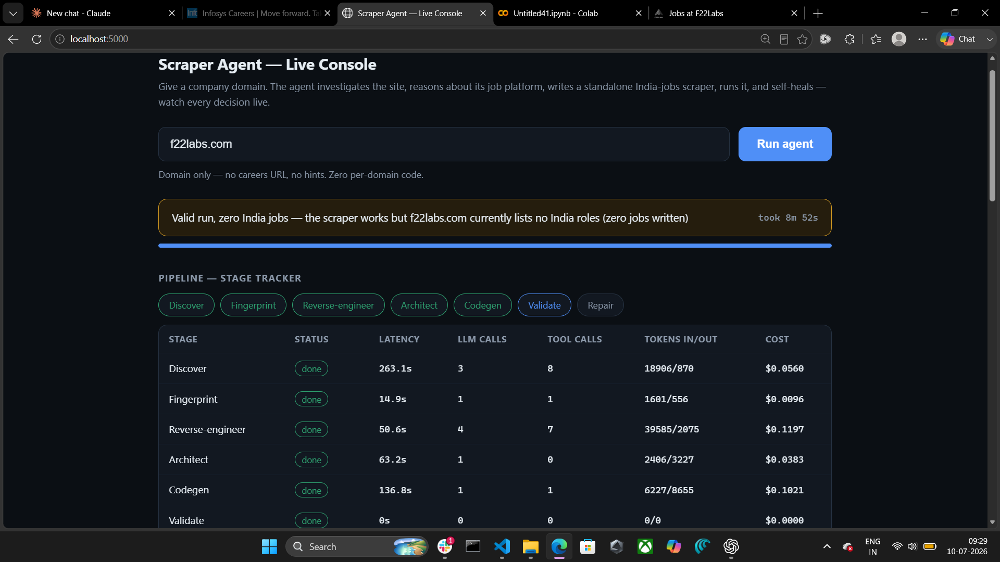
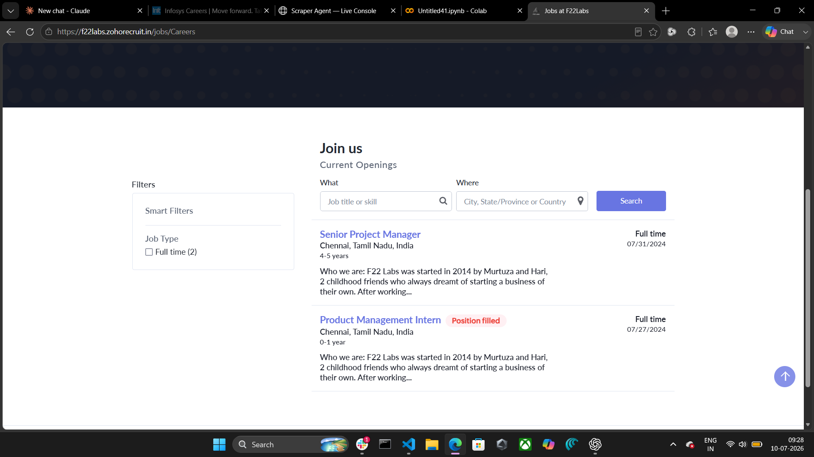

# AI Agent That Writes Job-Scraper Scripts

Given **only a company domain** (e.g. `swissre.com`), this agent investigates the site on its
own and **generates a standalone Python scraper** that extracts that company's **India-based
job listings** as JSONL — zero human intervention, zero per-domain hardcoded logic. The agent
then runs the script it wrote, validates the output, and rewrites it itself if it's broken.

The agent is not the scraper. The agent is the thing that *produces* the scraper. The generated
script runs anywhere with plain Python — **no LLM calls at runtime**.



---

## The pipeline — 9 stages, every arrow an LLM decision

`agent/orchestrator.py` sequences the stages; discovery and reverse-engineering are *agentic
tool loops* (`agent/llm.py: agentic_loop`) where the LLM itself picks which tool to call next
and decides when it has enough evidence. Nothing anywhere is `if domain == "x"`.

| # | Stage | What it does | How |
|---|-------|--------------|-----|
| 1 | **Discover** (`discovery.py`) | Finds the real job-listing page — not just a "Careers" marketing page | Web search + robots.txt/sitemap + generic path probing + rendered fetches; follows region navigation (Careers → Asia Pacific → India) and "search jobs" CTAs; deterministically verifies the final page actually lists jobs |
| 2 | **Fingerprint** (`fingerprint.py`) | Identifies the job platform (Greenhouse, Workday, Zoho Recruit, Radancy, custom…) with confidence + evidence | Collects platform/framework signals from the page; LLM makes the classification call — never a silent guess |
| 3 | **Reverse-engineer** (`reverse_engineer.py`) | Works out exactly how the job data is served and how pagination works | Checks, in order: embedded/hydration JSON (incl. JSON hidden in `<input>` elements), REST/GraphQL APIs (grep JS bundles, verify candidate endpoints with real calls), SSR HTML, rendered-list + SSR-detail, full SPA. Every endpoint is verified with a real HTTP round-trip before being trusted. Deterministic self-checks: an India location facet probe (activates + verifies server-side country filters) and an SSR downgrade check (if raw HTML already has the job links, no browser needed) |
| 4 | **Memory** (`memory.py`) | Reuses the agent's own past successes on the same platform as a starting *hint* | Self-authored `platform_memory.json`; always re-verified against the new site, never blindly reused — cost/latency drop on repeat platforms without becoming a hidden hardcoded branch |
| 5 | **Architect** (`architect.py`) | Produces a structured scrape plan | Field-extraction mapping, India-filter strategy, pagination plan — structured LLM output |
| 6 | **Codegen** (`codegen.py`) | Writes the actual standalone `scraper.py` | LLM writes the script against the plan + a cleaned sample of the *real* page HTML/JSON-LD (so selectors match the actual DOM, not guesses). Hard rules: no regex for field extraction, missing fields → `null`, structural India filtering only, universal pagination-termination guard, robust JSON-LD/location helpers embedded verbatim |
| 7 | **Sandbox + Validate + Repair** (`sandbox.py`, `validator.py`, `repair.py`) | Proves the generated script actually works — or fixes it | Runs the script in a subprocess with timeouts; validator classifies three-way: `success` / `success_empty` (legitimately zero India jobs) / `failure`, checking schema, India-ness of every job, duplicates, URL absoluteness, title coverage. On failure the agent rewrites the script and retries, up to 3 times |
| 8 | **LinkedIn enrichment** (`linkedin_jobs.py`) | Bonus cross-platform layer: the same company's India postings as they appear on LinkedIn | Via SerpAPI's Google Jobs index (never scrapes linkedin.com); deterministic, no LLM calls; wrapped so it can never break the core deliverable |
| 9 | **Report** (`orchestrator.py`) | Full accountability per run | `trace.jsonl` (every reasoning step + tool call I/O), `report.md`/`report.json` (status, confidence %, evidence bullets, validation checks, token/tool/$ cost, wall clock) |

## Features at a glance

- **Agentic, not a fixed pipeline** — endpoint, selectors, pagination, repair patches: all LLM
  decisions at runtime (§3.1 of the problem statement)
- **Zero per-domain code** — the same code ran unmodified against every domain below (§3.2)
- **Self-verifying + self-healing** — the agent runs what it wrote and repairs it on failure (§3.3)
- **No regex in generated code** — CSS selectors / JSON paths / structured data only (§3.4)
- **Missing fields → `null`, never inferred** (§3.5)
- **Full reasoning/action trace per run** (§3.6)
- **Three-way honest outcomes** — an empty JSONL is a valid result; failures are reported with
  evidence, never papered over with fabricated data
- **Cross-run platform memory** (stretch goal) — self-taught, hint-only, re-verified
- **Cost report per domain** (stretch goal) — tokens, calls, retries, $, wall clock
- **Bot-protection handling** (stretch goal) — Firecrawl rendering bypasses Cloudflare challenges
  that block plain headless browsers; WAF-aware headers; honest failure over hanging
- **Live web UI** — watch the agent think in real time: stage tracker with per-stage
  latency/tokens/cost, live decision timeline with evidence + confidence, ETA + progress bar,
  results table, the generated scraper code front-and-center with copy/download, and a
  LinkedIn cross-platform section

## Results (same code, no per-domain changes)

| Domain | Platform detected | Source type | Result |
|---|---|---|---|
| swissre.com | custom (SuccessFactors-backed) | rendered list + SSR detail | ✅ 32 India jobs |
| razorpay.com | Greenhouse | REST API | ✅ 14 India jobs |
| figma.com | Greenhouse | REST API | ✅ 2 India jobs (matches ground truth exactly) |
| munichre.com | Radancy | SSR HTML + verified India facet | ✅ 4 India jobs |
| accenture.com | Workday-style | rendered list + SSR detail | ✅ 12 India jobs |
| f22labs.com | Zoho Recruit | embedded JSON (hidden `<input>`) | ✅ 2 India jobs (matches ground truth exactly) |
| linear.app | custom | SSR HTML | ✅ honest `success_empty` — genuinely no India roles |
| infosys.com | custom Angular SPA | SPA (async XHR render) | ⚠️ honest `failure` — flaky client-side render; agent self-healed 3× then reported honestly instead of fabricating |

Ground truth for f22labs.com (2 Chennai roles on their Zoho board) vs what the agent's UI shows:



## Setup

```bash
pip install -r requirements.txt
cp .env.example .env
# fill in .env:
#   OPENAI_API_KEY=...
#   OPENAI_MODEL=gpt-5.4-mini        (any chat-completions model works; quirks auto-handled)
#   SERPAPI_KEY=...
#   FIRECRAWL_API_KEY=...
```

## Run — Web UI (recommended)

```bash
python ui/app.py
# open http://localhost:5000
```

Type any company domain (just `swissre` works — normalized to `swissre.com`) and hit
**Run agent**. You watch the agent live: every pipeline stage with per-stage latency and cost,
every decision with its evidence and confidence, ETA + progress bar. When it finishes you get
the India-jobs table, the generated scraper code (copy/download), run stats, the LinkedIn
cross-platform table, and download buttons for every artifact.

## Run — CLI

```bash
python -m agent.orchestrator run swissre.com
```

Outputs land in `generated/<domain>/`:
- `scraper.py` — the standalone generated scraper (no LLM calls at runtime)
- `output.jsonl` — one India job per line, per the required schema
- `linkedin_jobs.jsonl` — the same company's India postings on LinkedIn (bonus)
- `trace.jsonl` — full reasoning/tool-call trace of the agent's run
- `report.json` / `report.md` — status, confidence, evidence, validation checks, cost

## Running a generated scraper on its own (no agent, no LLM)

Anyone can run these anywhere with Python + `pip install requests beautifulsoup4 lxml`:

```bash
# Clean ATS / embedded-JSON sites (razorpay, figma, f22labs, munichre): no key needed
python generated/razorpay.com/scraper.py out.jsonl

# JS / bot-protected sites (swissre, accenture): the scraper renders the listing via the
# Firecrawl API (a rendering service, NOT an LLM), so set the key first:
set FIRECRAWL_API_KEY=fc-...          # Windows  (Linux/Mac: export FIRECRAWL_API_KEY=fc-...)
python generated/swissre.com/scraper.py out.jsonl
```

Each line of `out.jsonl` is one India-based job. An empty file is a valid result.

## Output schema

```json
{
  "title": "...", "job_id": "...",
  "location": {"city": "...", "state": null, "country": "India", "country_code": "IN"},
  "url": "...", "apply_url": "...",
  "date_posted": "2026-01-15", "date_posted_text": "Posted 3 days ago",
  "job_description": "...",
  "employment_type": null, "work_type": null, "salary_range": null
}
```
Missing fields are always `null` — never inferred, never guessed.

## Edge cases handled

No careers page found (honest report, no fabricated script) · careers page with zero jobs ·
jobs exist but none in India · multi-page pagination (offset / page number / cursor /
load-more, with a universal no-new-records termination guard) · REST + GraphQL APIs ·
embedded/hydration JSON (including job lists hidden inside `<input>` elements) · SPA/
infinite-scroll sources · bot protection & WAF 403s · missing fields → null · duplicate jobs ·
relative URLs · unparseable dates · rate limiting (exponential backoff) · post-generation
script failure (self-heal loop, ≤3 attempts) · lossy HTML parsers (lxml subtree drops
detected and auto-fallback).

## Repo layout

```
agent/                the agent itself (one module per pipeline stage)
ui/                   Flask live-console web UI
generated/<domain>/   one folder per domain the agent has run against
docs/                 screenshots
platform_memory.json  agent's own cross-run platform pattern cache
```
